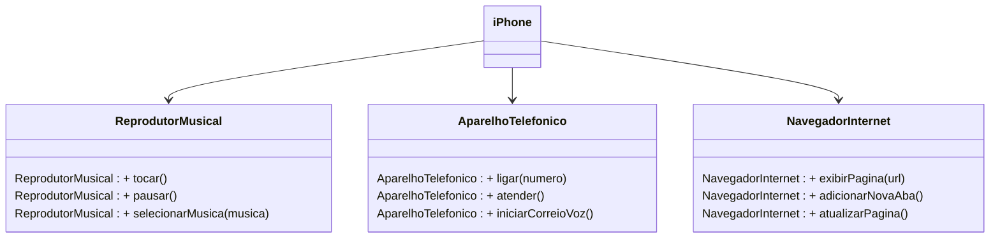

# Modelagem e Diagramação de um Componente iPhone - UML



##Codando
#Interfaces

```java
package DispositivoIphone;

public interface ReprodutorMusical {
    void tocar();
    void pausar();
    void selecionarMusica(String musica);

}

package DispositivoIphone;

public interface NavegadorInternet {
    void ligar(String numero);
    void atender ();
    void iniciarCorreioVoz();
    
}

package DispositivoIphone;

public interface AparelhoTelefonico {
    void exibirPagina(String url);
    void adicionarNovaAba();
    void atualizarPagina();    

}
```
#Implements

```java
package DispositivoIphone;

import java.util.Locale;
import java.util.Scanner;

public class Iphone implements ReprodutorMusical, AparelhoTelefonico, NavegadorInternet {

    public static void main(String[] args) {
        Iphone meuIPhone = new Iphone();
        try (Scanner scanner = new Scanner(System.in).useLocale(Locale.US)) {
            // Testando as funcionalidades do reprodutor musical
            meuIPhone.tocar();
            meuIPhone.pausar();
            System.out.println("Selecione a música");
            String musica = scanner.next();
            meuIPhone.selecionarMusica(musica);

            // Testando as funcionalidades do aparelho telefônico
            System.out.println("Digite o núemro do telefone");
            String numero = scanner.next();
            meuIPhone.ligar(numero);
            meuIPhone.atender();
            meuIPhone.iniciarCorreioVoz();

            // Testando as funcionalidades do navegador na internet
            System.out.println("Digite a url do site");
            String url = scanner.next();
            meuIPhone.exibirPagina(url);
        }

        meuIPhone.adicionarNovaAba();
        meuIPhone.atualizarPagina();
    }

    @Override
    public void ligar(String numero) {
       System.out.println("Ligando para " + numero + " ...");
    }

    @Override
    public void atender() {
        System.out.println("Atendendo chamada");
    }

    @Override
    public void iniciarCorreioVoz() {
        System.out.println("Iniciando coerreio de voz");
    }

    @Override
    public void exibirPagina(String url) {
        System.out.println("Exibindo a página " + url);
    }

    @Override
    public void adicionarNovaAba() {
        System.out.println("Abrindo nova aba");
    }

    @Override
    public void atualizarPagina() {
        System.out.println("Página atualizada");
    }

    @Override
    public void tocar() {
        System.out.println("Tocando música");;
    }

    @Override
    public void pausar() {
        System.out.println("Música pausada");
    }

    @Override
    public void selecionarMusica(String musica) {
        System.out.println("Música selecionada: " + musica);
    }    
        
}
```


